# 🏗️ Architecture DevMateriels - Diagramme Complet

## Diagramme Mermaid

## Diagramme de sequence (le processus de l'inspection et le devis)

```mermaid
sequenceDiagram
    autonumber

    participant WL as 🏢 ERP WagonLits
    participant GW as 🚪 API Gateway
    participant PS as 📅 Planning Service
    participant DS as 📄 Devis Service
    participant KF as 📨 Kafka
    participant NS as 🔔 Notification Service
    participant ERP_WL as 💾 DB WagonLits
    participant ERP_DM as 💾 DB DevMateriels

    rect rgb(200, 230, 255)
        Note over WL,ERP_DM: 📋 PHASE 1 : Demande d'inspection
        WL->>GW: POST /api/inspection/request<br/>{wagon_id, issue_description}
        GW->>PS: HTTP Proxy
        PS->>PS: Créer inspection en BDD
        PS->>PS: Récupérer créneaux disponibles
        PS-->>GW: {inspection_id, available_slots[]}
        GW-->>WL: Réponse avec créneaux
    end

    rect rgb(255, 230, 200)
        Note over WL,ERP_DM: 📅 PHASE 2 : Confirmation du créneau
        WL->>GW: POST /api/inspection/schedule/{slot_id}<br/>{inspection_id, location}
        GW->>PS: HTTP Proxy
        PS->>PS: Réserver créneau + Assigner technicien
        PS->>KF: Publish "inspection.scheduled"
        PS-->>GW: {status: confirmed, technician}
        GW-->>WL: Confirmation planification

        Note over KF,ERP_DM: 🔔 Notifications asynchrones
        KF->>NS: Consume "inspection.scheduled"
        par Webhooks parallèles
            NS->>ERP_WL: POST /api/notifications (Webhook)
            ERP_WL->>ERP_WL: Mise à jour inspection_requests
        and
            NS->>ERP_DM: POST /api/notifications (Webhook)
            ERP_DM->>ERP_DM: Créer/MAJ intervention
        end
    end

    rect rgb(230, 255, 200)
        Note over WL,ERP_DM: 📄 PHASE 3 : Génération du devis
        WL->>GW: POST /api/devis/generate<br/>{inspection_id, parts[], hours}
        GW->>DS: HTTP Proxy
        DS->>DS: Vérifier stock disponible
        alt Stock OK
            DS->>DS: Calculer montants
        else Stock insuffisant
            DS-->>GW: {can_validate: false, modifications_required[]}
        end
        DS->>DS: Créer devis en BDD
        DS->>KF: Publish "devis.generated"
        DS-->>GW: {devis, can_validate, pricing}
        GW-->>WL: Devis avec statut stock

        Note over KF,ERP_DM: 🔔 Notifications asynchrones
        KF->>NS: Consume "devis.generated"
        par Webhooks parallèles
            NS->>ERP_WL: POST /api/notifications (Webhook)
            ERP_WL->>ERP_WL: Créer devis_received
        and
            NS->>ERP_DM: POST /api/notifications (Webhook)
            ERP_DM->>ERP_DM: MAJ intervention avec montant
        end
    end

    rect rgb(255, 200, 200)
        Note over WL,ERP_DM: ✅ PHASE 4 : Validation du devis
        WL->>GW: POST /api/devis/{id}/validate<br/>{confirmed_by}
        GW->>DS: HTTP Proxy
        DS->>DS: Valider devis + Réserver stock
        DS->>KF: Publish "devis.validated"
        DS-->>GW: {status: validated, confirmation}
        GW-->>WL: ✅ Devis validé!

        Note over KF,ERP_DM: 🔔 Notifications asynchrones
        KF->>NS: Consume "devis.validated"
        par Webhooks parallèles
            NS->>ERP_WL: POST /api/notifications (Webhook)
            ERP_WL->>ERP_WL: Créer ORDER
        and
            NS->>ERP_DM: POST /api/notifications (Webhook)
            ERP_DM->>ERP_DM: Créer FACTURE + Réserver stock
        end
    end

    Note over WL,ERP_DM: 🎉 FIN : Commande créée, Facture générée, Stock réservé
```

---

## 📊 Tableau des Communications

| Source               | Destination          | Type        | Protocole | Exemple                      |
| -------------------- | -------------------- | ----------- | --------- | ---------------------------- |
| WagonLits            | API Gateway          | Requête     | HTTP POST | `/api/inspection/request`    |
| API Gateway          | Planning Service     | Proxy       | HTTP      | Routes vers `:5001`          |
| API Gateway          | Devis Service        | Proxy       | HTTP      | Routes vers `:5002`          |
| Planning Service     | Kafka                | Publish     | Kafka     | Topic `inspection.scheduled` |
| Devis Service        | Kafka                | Publish     | Kafka     | Topic `devis.validated`      |
| Kafka                | Notification Service | Consume     | Kafka     | Consumer group               |
| Notification Service | WagonLits            | **Webhook** | HTTP POST | `/api/notifications`         |
| Notification Service | DevMateriels         | **Webhook** | HTTP POST | `/api/notifications`         |
| Tous les services    | PostgreSQL           | Persistance | SQL       | Chaque service sa BDD        |

---

## 🔄 Flux Complet (Exemple: Validation Devis)

---

## 🎯 Légende

- **HTTP** : Communication synchrone requête/réponse
- **Kafka** : Communication asynchrone via topics
- **Webhook** : Notification push HTTP POST vers les ERPs
- **SQL** : Persistance dans PostgreSQL
