# 🏗️ Architecture DevMateriels - Diagramme Complet

## Diagramme Mermaid

```mermaid
flowchart TB
    subgraph CLIENTS["🏢 Clients Externes"]
        WL["ERP WagonLits<br/>:5010"]
        CW["ERP ConstructWagons"]
    end

    subgraph GATEWAY["🚪 Point d'Entrée"]
        API["API Gateway<br/>:8000"]
    end

    subgraph MICROSERVICES["⚙️ Microservices DevMateriels"]
        PS["Planning Service<br/>:5001"]
        DS["Devis Service<br/>:5002"]
        NS["Notification Service<br/>:5003"]
    end

    subgraph DATABASES["💾 Bases de Données PostgreSQL"]
        DB_PS[("db-planning<br/>:5432")]
        DB_DS[("db-devis<br/>:5433")]
        DB_NS[("db-notification<br/>:5434")]
        DB_WL[("db-erp-wagonlits<br/>:5435")]
        DB_DM[("db-erp-devmateriels<br/>:5436")]
    end

    subgraph MESSAGING["📨 Messagerie Asynchrone"]
        ZK["Zookeeper<br/>:2181"]
        KF["Kafka<br/>:9093"]
    end

    subgraph ERP_INTERNAL["🏭 ERP Interne"]
        DEMAT["ERP DevMateriels<br/>:5011"]
    end

    %% Communications HTTP
    WL -->|"HTTP POST<br/>/api/inspection/request"| API
    API -->|"HTTP"| PS
    API -->|"HTTP"| DS

    %% Microservices vers leurs BDD
    PS -.->|"SQL"| DB_PS
    DS -.->|"SQL"| DB_DS
    NS -.->|"SQL"| DB_NS

    %% Kafka
    PS -->|"Kafka Publish<br/>inspection.scheduled"| KF
    DS -->|"Kafka Publish<br/>devis.validated"| KF
    KF -->|"Kafka Consume"| NS
    ZK -.->|"Coordination"| KF

    %% Webhooks
    NS ==>|"🔔 WEBHOOK<br/>HTTP POST"| WL
    NS ==>|"🔔 WEBHOOK<br/>HTTP POST"| DEMAT

    %% ERPs vers leurs BDD
    WL -.->|"SQL"| DB_WL
    DEMAT -.->|"SQL"| DB_DM

    %% Styling
    classDef gateway fill:#ff9800,stroke:#e65100,color:#000
    classDef service fill:#2196f3,stroke:#1565c0,color:#fff
    classDef database fill:#4caf50,stroke:#2e7d32,color:#fff
    classDef kafka fill:#9c27b0,stroke:#6a1b9a,color:#fff
    classDef erp fill:#607d8b,stroke:#37474f,color:#fff
    classDef webhook fill:#f44336,stroke:#c62828,color:#fff

    class API gateway
    class PS,DS,NS service
    class DB_PS,DB_DS,DB_NS,DB_WL,DB_DM database
    class KF,ZK kafka
    class WL,CW,DEMAT erp
```

---

## 📊 Tableau des Communications

| Source               | Destination          | Type        | Protocole | Exemple                      |
| -------------------- | -------------------- | ----------- | --------- | ---------------------------- |
| WagonLits            | API Gateway          | Requête     | HTTP POST | `/api/inspection/request`    |
| API Gateway          | Planning Service     | Proxy       | HTTP      | Routes vers `:5001`          |
| API Gateway          | Devis Service        | Proxy       | HTTP      | Routes vers `:5002`          |
| Planning Service     | Kafka                | Publish     | Kafka     | Topic `inspection.scheduled` |
| Devis Service        | Kafka                | Publish     | Kafka     | Topic `devis.validated`      |
| Kafka                | Notification Service | Consume     | Kafka     | Consumer group               |
| Notification Service | WagonLits            | **Webhook** | HTTP POST | `/api/notifications`         |
| Notification Service | DevMateriels         | **Webhook** | HTTP POST | `/api/notifications`         |
| Tous les services    | PostgreSQL           | Persistance | SQL       | Chaque service sa BDD        |

---

## 🔄 Flux Complet (Exemple: Validation Devis)

---

## 🎯 Légende

- **HTTP** : Communication synchrone requête/réponse
- **Kafka** : Communication asynchrone via topics
- **Webhook** : Notification push HTTP POST vers les ERPs
- **SQL** : Persistance dans PostgreSQL
