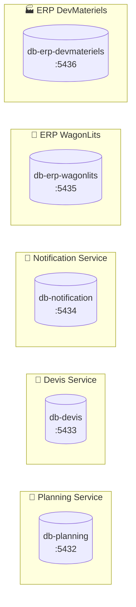
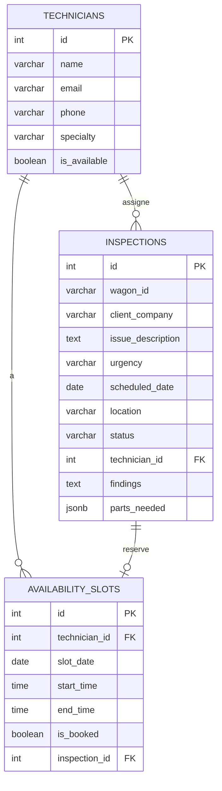
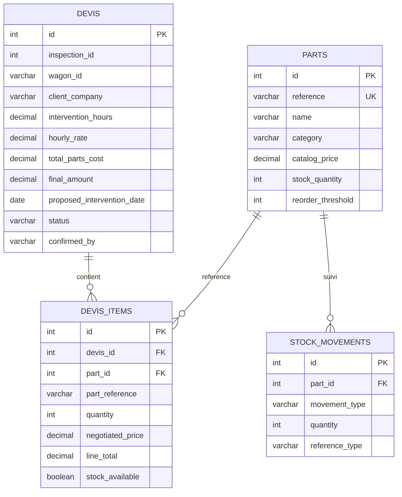
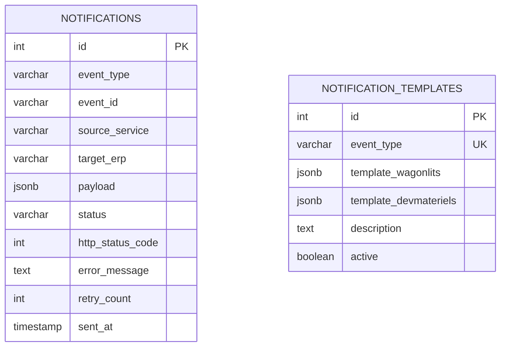
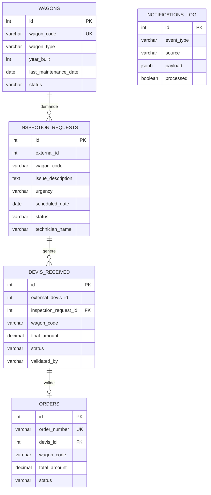
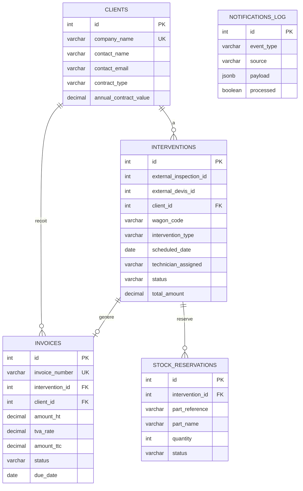

# 💾 Architecture Base de Données - DevMateriels

## Vue d'ensemble

---

## 📅 Base Planning Service (db-planning)

---

## 📄 Base Devis Service (db-devis)

---

## 🔔 Base Notification Service (db-notification)

---

## 🏢 Base ERP WagonLits (db-erp-wagonlits)

---

## 🏭 Base ERP DevMateriels (db-erp-devmateriels)

---

## 📊 Résumé des Tables par Service

| Service          | Base                | Tables                                                       | Rôle                    |
| ---------------- | ------------------- | ------------------------------------------------------------ | ----------------------- |
| **Planning**     | db-planning         | `technicians`, `inspections`, `availability_slots`           | Gestion planification   |
| **Devis**        | db-devis            | `parts`, `devis`, `devis_items`, `stock_movements`           | Catalogue, devis, stock |
| **Notification** | db-notification     | `notifications`, `notification_templates`                    | Suivi des webhooks      |
| **WagonLits**    | db-erp-wagonlits    | `wagons`, `inspection_requests`, `devis_received`, `orders`  | Données client          |
| **DevMateriels** | db-erp-devmateriels | `clients`, `interventions`, `invoices`, `stock_reservations` | Données internes        |

---

## 🔑 Points Clés à Mentionner au Prof

1. **Chaque microservice a sa propre BDD** → Isolation, indépendance
2. **Pas de foreign keys entre services** → Communication via API/Kafka
3. **Payload JSONB** dans notifications → Flexibilité des données
4. **ERPs ont des tables miroir** → Stockent les données reçues via webhooks
